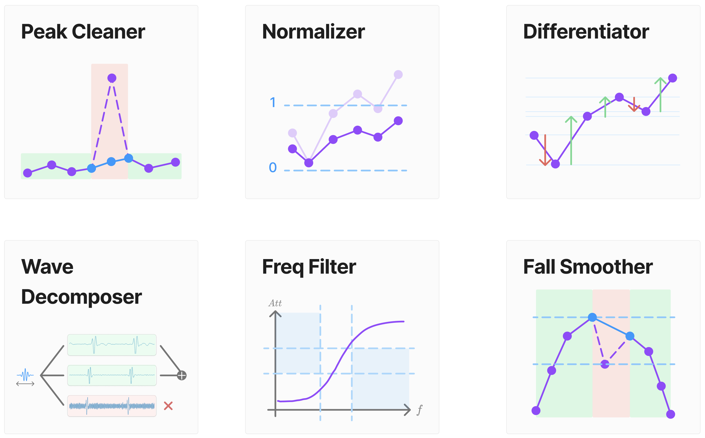
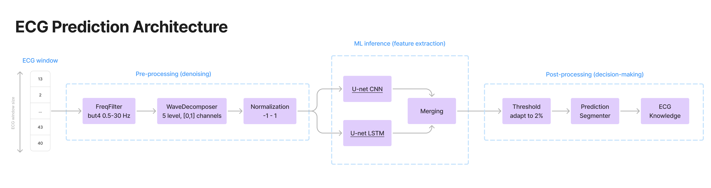
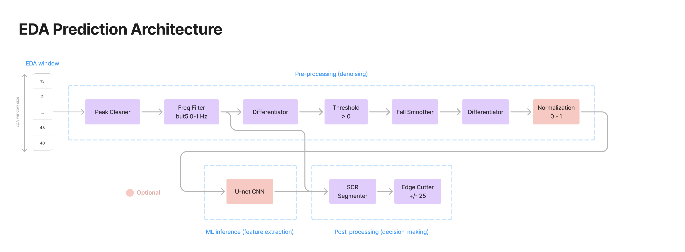

# Nervous Analytics

This package provides a pipeline for physiological signal processing.
It is designed to be modular and flexible, allowing the user to easily assemble pre-processing, ML inference and
post-processing steps.
The package is particularly useful for ECG and EDA signals, but can be adapted to other
physiological signals.

## Installation

> [!NOTE]
> Requires python version 3.10, 3.11 or 3.12
> ```bash
> pip install nervous-analytics
> ```


## Architecture

Our algorithm is composed of three stages.
Firstly, the pre-processing stage denoise and prepare the physiological signal.
Next, in the ML inference stage, the features are extracted using TensorFlow models that are executed in parallel.
Finally, the post-processing stage is responsible for the decision-making of the prediction.

### 1. Pre-processing

Regroups all the modules in charge of denoising & data preparation, called before ML inference



#### Code example

```python
from nervous_analytics.preprocessing import PreProcess, FreqFilter, Normalizer

# Example of a pre-processing pipeline that calls
# a frequency filter and next a normalizer
preprocess = PreProcess(
    [
        FreqFilter(fs=1024, cutoff=[0.5, 30], order=4, filter_type="bandpass"),
        Normalizer(norm_min=-1.0, norm_max=2.0),
    ]
)
```

### 2. ML Inference

Allows to load TensorFlow models and process their predictions in parrallel.
Next, a processing function can be used to combine the predictions of the models.

#### Code example

```python
from tensorflow.keras.models import load_model
from nervous_analytics.modeling import get_custom_loss_items, ModelInference
import numpy as np

model1_path = "path/to/model1.keras"
model2_path = "path/to/model2.keras"

# get_custom_loss_items() is necessary to load the model with
# the custom loss function from nervous-analytics
model1 = load_model(model1_path, custom_objects=get_custom_loss_items())
model2 = load_model(model2_path, custom_objects=get_custom_loss_items())

models_dico = {
    "Model1": model1,
    "Model2": model2,
}

# Example of a function that uses the predictions of two models
# to create a final prediction
def processing_pred_dico_func(pred_dico):
    cnn_pred = pred_dico["Model1"]
    lstm_pred = pred_dico["Model2"]
    avg_pred = np.mean([cnn_pred, lstm_pred], axis=0)
    return "Avg", avg_pred

model_inference = ModelInference(
    models_dico=models_dico,
    processing_pred_dico_func=processing_pred_dico_func,
)
```

### 3. Post-processing

Regroups all the modules in charge of decision-making, called after ML inference.


#### Code example

```python
from nervous_analytics.postprocessing import PostProcess, Threshold, PredictionSegmenter

# Example of a post-processing pipeline that calls
# a threshold and next a prediction segmenter
postprocess = PostProcess(
    [
        Threshold(non_zero_data_rate=0.02, output_thresholded_range=[0.05, 1]),
        PredictionSegmenter(),
    ]
)
```

### 4. Assemble and use the pipeline

The `PhysioPrediction` class is a wrapper that assembles the pre-processing,
ML inference and post-processing steps.
The `predict()` method takes a signal as input and returns a `PredictionTracker`
object that contains the output of each step thought for pipeline analysis.

#### Code example

```python
from nervous_analytics import PhysioPrediction

# Python list or numpy array
signal = get_some_physiological_signal()

# Assemble pre-processing, ML inference and post-processing
# Each of these steps can be None if not needed
physio_process = PhysioPrediction(
    preprocess=preprocess,
    model_inference=model_inference,
    postprocess=postprocess,
)

tracker = physio_process.predict(signal)
print(tracker.get_all())
```

#### Print output

| process_name        | process_output |
|---------------------|----------------|
| Input               | [ ... ]        |
| FreqFilter          | [ ... ]        |
| Normalizer          | [ ... ]        |
| Model1Prediction    | [ ... ]        |
| Model2Prediction    | [ ... ]        |
| AvgPrediction       | [ ... ]        |
| Threshold           | [ ... ]        |
| PredictionSegmenter | [ ... ]        |


## Template example for ECG and EDA

The `nervous_analytics` package provides the exact templates below for ECG and EDA.


<br>


#### Code example

```python
from nervous_analytics.template import get_ecg_template, get_eda_template

ecg_physio_prediction = get_ecg_template()
eda_physio_prediction = get_eda_template()
```
