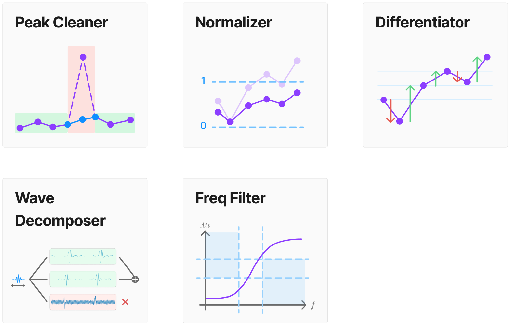
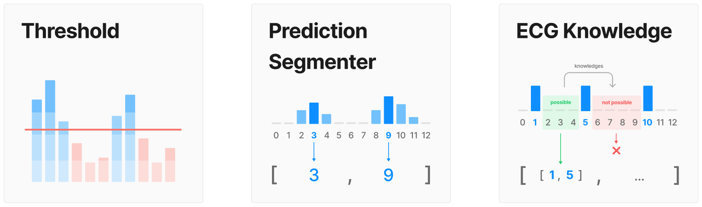

# Pre-process modules
Regroups all the modules in charge of denoising & data preparation, called before ML inference

# Post-process modules
Regroups all the modules in charge of decision-making, called after ML inference.

